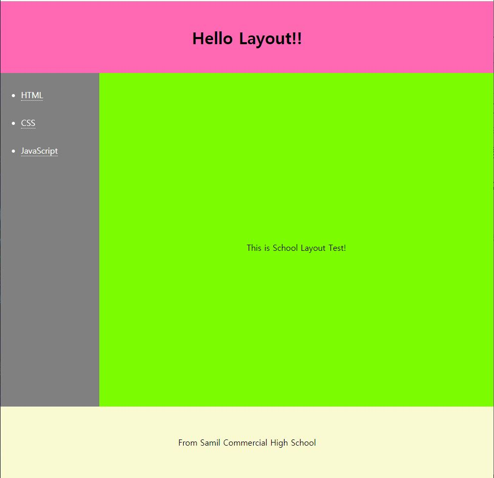

# 학교 수행평가 준비
## 레이아웃 만들어보기
---
```
세로 크기의 조절은 vh

가로 크기는 width:100%
(이때 body 의 기본마진 값을 0으로 주어야 함)

텍스트의 수직방향 가운데 정렬은 line-height:(세로길이) 로 조절한다
```
---
```html
<style>
    height:100vh;
    width:100%;
    line-height:100vh;
</style>
```
---

- 화면의 100% 를 활용할 수 있는가???

